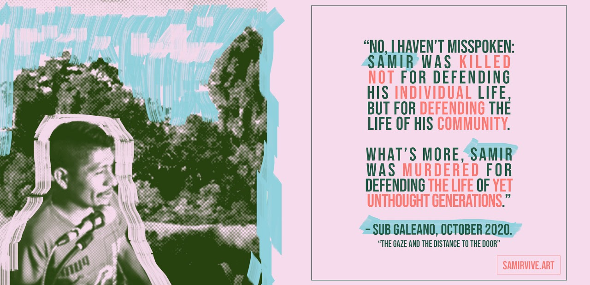

Samir Vive (Samir lives) is an ongoing multimedia project that honors the life and practice of Samir Flores Soberanes, a journalist and environmental activist who was murdered for defending the land and water of his community Amilcingo in Morelos, Mexico. Samir Lives, the struggle continues. Find out more in [#SamirVive](https://www.samirvive.art/).

> "For Samir, as for his compañeras and compañeros, and for the originary peoples that make up the CNI and for us, nosotros, nosotras, nosotroas Zapatistas, the life of a community doesn’t take place only in the present: it is above all what is to come. The life of a community is something that is built today, but built for tomorrow. That is, life in community is something that is passed on to future generations." - [SupGaleano](http://enlacezapatista.ezln.org.mx/2020/10/11/part-five-the-gaze-and-the-distance-to-the-door/)

